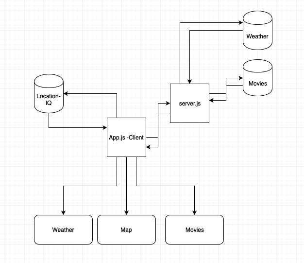

# City Explorer API

**Author**: Ian Cargill\
**Version**: 1.0.0

## Overview

An api backend for the City-Explorer app. Processes api request for movie and weather information.

## Getting Started

npm run server\
Will acitvate your server for testing.

## Architecture

- express.js
- dotenv

The backend API is built with an express server.

## Change Log

10-15-2020 7:00pm Refactor components
10-13-2020 11:00pm Movie information is displayed on client/ hosted on Heroku and Netlify\
10-9-2021 4:30pm Weather Forcast returned to client - client side display\
10-9-2021 12:30pm Project initialized.

## Credit and Collaborations

I would like to thank the internet.

### Time Estimates

#### API Data Response

Estimate of time needed to complete: 1 hour\
Start time: 1:30pm\
Finish time: 2:30pm\
Actual time needed to complete: 1 hour

#### Front End Weather Display

Estimate of time needed to complete: 1 hour\
Start time: 3:00pm\
Finish time: 4:30pm\
Actual time needed to complete: 1.5 hours

#### Server Side Error Handling

Estimate of time needed to complete: 1 hour\
Start time: 4:35pm\
Finish time: 4:50pm\
Actual time needed to complete: 25 min

#### Movie Data Display

Estimate of time needed to complete: 1 hour\
Start time: 7:00pm\
Finish time: 9:00pm\
Actual time needed to complete: 2 hours

#### Refactor

Estimate of time needed to complete: 30 minutes
Start time: 6:30pm
Finish time: 6:50pm
Actual time needed to complete: 20 minutes

<!-- Name of feature:
Estimate of time needed to complete:
Start time:
Finish time:
Actual time needed to complete: -->
